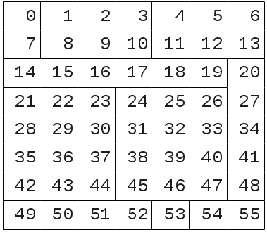

.. cf-python documentation master file, created by
   sphinx-quickstart on Wed Aug  3 16:28:25 2011.
   You can adapt this file completely to your liking, but it should at least
   contain the root `toctree` directive.

.. toctree::
   :maxdepth: 2

On the storage of arbitrarily aggregated data arrays (|version|)
################################################################

Abstract
========

This document describes a framework for storing arbitrarily aggregated
data arrays within memory and proposes a convention for efficiently
storing them in a file.

Introduction
============

The proposed `CF aggregation rules
<https://cf-pcmdi.llnl.gov/trac/ticket/78>`_ allow for the aggregation
of CF fields across multiple dimensions. These rules are based solely
on the fields' metadata, therefore allowing aggregation to be reliably
automated. This raises the possibility of large amounts of
aggregations being created and therefore storing these collections is
clearly desirable.

This document describes how the data arrays of such aggregations could
be stored in the memory of an application and proposes a convention --
the NCA (netCDF aggregate) convention -- for their efficient file
storage.

The key element of the NCA files is that they are CF-compliant netCDF
files, albeit ones which require extra processing to realise their
aggregated data arrays.

This style of aggregation marks a considerable advance from `NetCDF
Markup Language (NcML) aggregation
<http://www.unidata.ucar.edu/software/netcdf/ncml/v2.2/Aggregation.html>`_,
which has long-standing use in the community but is relatively
limited.

A conceptual framework for the in-memory storage of aggregated arrays
=====================================================================

An **aggregated data array** (or **master array**) is one which is
**partitioned** such that each **partition** is replaced by a
reference to an independent, non-aggregated array which contains the
data, called a **sub-array**.

Aggregated data arrays arise naturally from the `aggregation process
<https://cf-pcmdi.llnl.gov/trac/ticket/78>`_, but may be generated by
other mechanisms (such the `Large Amounts of Massive Arrays (LAMA)
<http://cfpython.bitbucket.org/docs/cf-0.9.6/build/lama.html>`_
functionality of `cf-python <http://cfpython.bitbucket.org>`_).

The sub-array referred to by each **partition** exists either as an
actual array in memory or as another reference to an array contained
within a file.

The master array may be partitioned along any, arbitrary subset of its
dimensions. The choice of partition positions does not affect the
master array. The only constraint on partition positions is that the
matrix of partitions (the **partition matrix**) must be be
hyperrectangular, i.e. it must not ragged along any of the partition
dimensions.

To meet the requirement of a hyperrectangular partition matrix, it may
be necessary to add **virtual partitions** to the master array. This
will be the case if the master array's sub-array edges are not all
aligned. Virtual partitions allow the master array to view a sub-array
as two or more independent sub-arrays without turning the sub-array
itself into an aggregated data array. Each virtual partition is a
reference to a **part** of a sub-array. Virtual partitions are
positioned so as to ensure that all partition edges are aligned and
therefore that the partition matrix is hyperrectangular.

The master array makes no distinction between partitions and virtual
partitions so, henceforth, both are referred as partitions, and a
**partition's data array** refers to the part of an array to which it
refers. The partition's sub-array is always the entire array of which
the partition's data array is a part.

----

**Example 1: Partitions of a 2 dimensional master array**

The 2-dimensional 8 x 7 master array in *figure 1a* is composed from
11 sub-arrays. These sub-arrays do not form a rectangular matrix (not
all of their edges are aligned), so virtual partitions are created
resulting in 24 partitions arranged in a hyperrectangular 4 x 6 matrix
(*figure 1b*).
      

   
   **Figure 1a**. The 11 sub-arrays of the master array.
     
.. figure:: partitions2.png

   **Figure 1b**. Each block of colour represents one of the 11
   sub-arrays and each of the master array's partitions is labelled P\
   :sub:`yx`\

----

Accounting for arbitrary sub-array properties
---------------------------------------------

There are aspects of a sub-array (such as the order of its dimensions) which
are arbitrary and are therefore do not affect the master array. Relative to
the master array, a sub-array may have:

* Differently ordered dimensions
* Missing or extra size 1 dimensions
* Dimensions which run in different senses
* Different, but equivalent, units

When a partition's data array is required by the master array, it needs to
be **conformed** by doing any or none of:

* Reordering its dimensions to the same order as the master array
* Removing size 1 dimensions which don't exist in the master array
* Adding size 1 dimensions which exist in the master array but not in the sub-array
* Reversing dimensions which run in the opposite direction to the master array
* Converting the data values to have the same units as the master array

Parameters required for specifying an aggregated data array
===========================================================

It follows that an aggregated data array and its partitions may be
completely specified by a small number of parameters. The master array
comprises:

   **dtype**
      The data type of the master array's dimensions
   
   **units**
      The units of the master array.
   
   **calendar** (*optional*)
     The calendar of the master array.
   
   **dimensions**
      An ordered list of the master array's dimensions.
   
   **shape**
      An ordered list of the master array's dimension sizes.
   
   **directions**
      An ordered list of the master array's dimension directions.
   
   **pdimensions**
      An ordered list of the dimensions along which the master array
      is partitioned.
   
   **pshape**
      An ordered list containing the number of partitions along each
      partitioned dimension of the master array. The sizes correspond
      to the *pdimensions* list.
   
   **Partitions**
      A matrix of the master array's partitions.

Each partition comprises:

   **location**
      An ordered list of the ranges of indices for each dimension of
      the master array which describe the section of the master array
      spanned by this partition.
   
   **dimensions**
      An ordered list of the partition's data array's dimensions.
   
   **directions**
      An ordered list of the partition's data array's dimension
      directions.
   
   **units**
      A string containing the units of the partition's data array.
   
   **calendar** (*optional*)
      A string containing the calendar of the partition's data array.
   
   **part**
      An ordered list of indices for each dimension of the partition's
      sub-array which describes the part of the sub-array which
      applies to this partition.
   
   **data**
      A reference to the partition's sub-array.

The NCA convention
==================

**A proposal for the efficient netCDF file storage of aggregated data
arrays**

Storing the aggregated data array parameters in a string
--------------------------------------------------------

With the exception of a partition's *data* parameter, all of the
values of the parameters which describe an aggregated data array are
of one the following basic types:

* string
* number
* boolean
* list
* associative array

The partition's *data* parameter is more complicated, as it may be an
actual array in memory or some type of reference to a file. In the
latter case, the reference may be encapsulated by a collection of
these basic types (for example, if the reference is to a netCDF
variable, then all that is required are its filename (string), the
variable name (string) and its shape (list of numbers)). In the former
case, note that when writing an aggregated array to a netCDF file, the
in-memory array may be written to a variable in the same netCDF file
as the aggregated data array and therefore all that is need are the
filename, the variable name and its shape (see *example 3*).

Therefore, when the aggregated data array is to be stored in a netCDF
file, the parameters which completely it may all be cast as the
aforementioned basic types end therefore may be easily encoded in a
JSON (JavaScript Object Notation) string for simple inclusion in the
file.

JSON is a lightweight data-interchange format which is easy for humans
to read and write and easy for machines to parse and generate. There
are JSON encoders and decoders for every reasonable language. See the
`JSON Wikipedia article <http://en.wikipedia.org/wiki/JSON>`_ for
examples.

Creating a netCDF variable for the aggregated data array
--------------------------------------------------------

A multidimensional aggregated data array may be stored in a **scalar
netCDF variable**, one of whose attributes is the JSON encoded string
of the aggregated data array parameters. When read, this scalar array
variable may then be converted to a multidimensional array variable
after the parameters have been decoded.

Such a variable is called an **NCA variable** (netCDF aggregate
variable) and a file storing NCA variables is called an **NCA file**
(netCDF aggregate file) and should include 'CF' and 'NCA' in its
global ``conventions`` attribute.

Advantages
^^^^^^^^^^

* NCA files are CF compliant.
* Variables within an NCA file may be a mixture of normal,
  multidimensional array variables and NCA variables.
* Much, if not all, of the discovery metadata in an NCA is independent
  of the aggregated data array convention and so is accessible to all
  netCDF readers.
* Changes to the elements of the aggregated data array may be stored.
* An NCA variable may have any attributes attached to it.
* NCA encoded parameters may be succinct, as there are clear rules on
  taking default values for partitions.

Disadvantages
^^^^^^^^^^^^^

* Software which creates and reads NCA files in their entirety needs
  to be able to cope with aggregated data arrays. However, `cf-python
  <http://cfpython.bitbucket.org>`_ can do this.

Comparison with NcML aggregation
^^^^^^^^^^^^^^^^^^^^^^^^^^^^^^^^

`NetCDF Markup Language (NcML) aggregation
<http://www.unidata.ucar.edu/software/netcdf/ncml/v2.2/Aggregation.html>`_
doesn't allow:

* Multidimensional aggregation
* Metadata-based aggregation
* Alterations to the data or metadata

Recommended usage
^^^^^^^^^^^^^^^^^

It is recommended, though not necessary to write the following types
of variable as normal (non-NCA) netCDF variables:

* 1-dimensional coordinates and their bounds (to facilitate
  discovery).

* Aggregated data arrays with only one partition whose data array is
  in-memory (to avoid unnecessary obfuscation).

----

**Example 2: A simple NCA file**::

   netcdf temperature.nca {
   dimensions:
          time = 48 ;
          lat = 64 ;
          lon = 128 ;
   variable: 

       double time(time) ;
               time:long_name = "time" ;
               time:units = "days since 0000-1-1" ;
       double lat(lat) ;
               lat:units = "degrees_north" ;
               lat:standard_name = "latitude" ;
       double lon(lon) ;
               lon:units = "degrees_east" ;
               lon:standard_name = "longitude" ;
       float tas ; 
               tas:standard_name = "air_temperature" ;
               tas:units = "K" ;
               tas:nca_dimensions = "time lat lon" ;
               tas:nca_array = "{directions': {'lat': false,
                                               'time': true,
                                               'lon': true
                                              },
                                 'pshape': [2],
                                 'pdimensions': ['time'],
                                 'Partitions': [{'index': [0],
                                                 'data': {'file': '/home/david/test1.nc',
                                                          'shape': [12, 64, 128],
                                                          'ncvar': 'tas'  
                                                         },
                                                 'location': [[0, 12], [0, 64], [0, 128]],
                                                 'format': 'netCDF'
                                                },
                                                {'index': [1],
                                                 'data': {'file': '/home/david/test2.nc',
                                                          'shape': [36, 64, 128],
                                                          'ncvar': 'tas2'
                                                         },
                                                 'location': [[12, 48], [0, 64], [0, 128]],
                                                 'format': 'netCDF'
                                                }
                                               ]
                                }" ;

   // global attributes:
                  :Conventions = "CF-1.5 NCA" ;
   data:
   
    time = 164569, 164599.5, 164630.5, 164660, 164689.5, 164720, 164750.5, 
          // etcetera.
   
    lat = -87.8638000488281, -85.0965270996094, -82.3129119873047,
          // etcetera.
    
    lon = 0, 2.8125, 5.625, 8.4375, 11.25, 14.0625, 16.875, 19.6875, 22.5, 
          // etcetera.

Points to note:

* The file specifies two conventions.
* The file contains one NCA variable (``tas``) and three normal
  variables (``time``, ``lat`` and ``lon``).
* The NCA variable stores the aggregated data array's dimensions in a
  separate attribute (``nca_dimensions``) to facilitate
  reconstruction of a multidimensional variable without having to decode
  the ``nca_array`` string.
* The ``nca_array`` string has been split over many lines for
  enhanced readability. Arbitrary new lines are permitted in JSON strings.
* The NCA variable defines its data type and units in the normal manner,
  so that these parameters of the master array may be omitted from
  the ``nca_array`` attribute.
* The NCA variable may have any CF-netCDF attributes, with no
  restrictions.
* Parameters of the partitions which are the same as their master array
  may be omitted.

----

**Example 3: storing an aggregated data array with an in-memory partition data array**::

   netcdf temperature2.nca {
   dimensions:
           time = 48 ;
           lat = 64 ;
           lon = 128 ;
           nca12 = 12 ;
           nca64 = 64 ;
           nca128 = 128 ;
   variable: 
           double time(time) ;
                   time:long_name = "time" ;
                   time:units = "days since 0000-1-1" ;
           double lat(lat) ;
                   lat:units = "degrees_north" ;
                   lat:standard_name = "latitude" ;
           double lon(lon) ;
                   lon:units = "degrees_east" ;
                   lon:standard_name = "longitude" ;
           float tas ; 
                   tas:standard_name = "air_temperature" ;
                   tas:units = "K" ;
                   tas:nca_dimensions = "time lat lon" ;
                   tas:nca_array = "{directions': {'lat': false,
                                                   'time': true,
                                                   'lon': true
                                                  },
                                     'pshape': [2],
                                     'pdimensions': ['time'],
                                     'Partitions': [{'index': [0],
                                                     'units' : 'K @ 273.15',
                                                     'dimensions': ['lon', 'time', lat'],
                                                     'directions': {'time': false},
                                                     'data': {'shape': [128, 12, 64],
                                                              'ncvar': 'nca_45sdf83745'  
                                                             },
                                                     'location': [[0, 12], [0, 64], [0, 128]],
                                                     'format': 'netCDF'
                                                    },
                                                    {'index': [1],
                                                     'data': {'file': '/home/david/test2.nc',
                                                              'shape': [36, 64, 128],
                                                              'ncvar': 'tas2'
                                                             },
                                                     'location': [[12, 48], [0, 64], [0, 128]],
                                                     'format': 'netCDF'
                                                    }
                                                   ]
                                    }" ;
           float nca_45sdf83745(nca128, nca12, nca64) ; 
                   nca_45sdf83745:nca_private = 1 ;
   
               
   // global attributes:
                   :Conventions = "CF-1.5 NCA" ;
   data:
   
    time = 164569, 164599.5, 164630.5, 164660, 164689.5, 164720, 164750.5, 
          // etcetera.
   
    lat = -87.8638000488281, -85.0965270996094, -82.3129119873047,
          // etcetera.
   
    lon = 0, 2.8125, 5.625, 8.4375, 11.25, 14.0625, 16.875, 19.6875, 22.5, 
          // etcetera.
   
    nca_45sdf83745 = -4.5, 3.5, 23.6, -4.45, 13.5, 13.6,
          // etcetera.

Points to note:

* The in-memory partition data array has been written to the file with an
  automatically generated variable name (``nca_45sdf83745``), which has an
  attribute ``nca_private`` to mark it as a private variable according to
  the NCA convention.
* The in-memory array had different units and dimension order relative to the
  master array.
* The time dimension of the in-memory array is decreasing, but the other
  dimensions run in the same sense as the master array.
* The private NCA variable has dimensions which are only used by private NCA
  variables.

----

A complete description of NCA attributes describing the aggregated data
-----------------------------------------------------------------------

``nca_private``
   The integer flagging the containing netCDF variable as containing a
   multidimensional array which is referred to by one or more of an
   aggregated data array partitions in the NCA file.

   For example: ``1``

   A value of ``0`` means the variable is *not* a private NCA
   variable, any other integer means that it is.

``nca_dimensions``
   An string containing and ordered, space delimited list of the
   master array's dimensions. The dimension names are all those of
   dimensions defined in the NCA file.

   For example: ``"time lat lon"``

``nca_array``
   A JSON encoded string containing parameters required for
   constructing the aggregated data array.

   Note the **dimensions**, **shape**, **dtype**, **units** and
   **calendar** parameters are specified elsewhere (in the
   ``nca_dimensions`` attribute or by the NCA variable itself) and so
   are not required.

   The *decoded* parameter names and types are described here.

   **directions**
      An associative array mapping each dimension of the master array
      to a direction. Each direction is described as ``true``
      (increasing) or ``false`` (decreasing).
      
      For example: ``{'time', true, 'lat': false, 'lon', true}``
      
      If the master array is a scalar then a boolean rather than an
      associative array is given. (Note that a scalar master array may
      have an implied direction (e.g. there are bounds associated with
      it or it contains a pressure datum).

   **pdimensions**
      An ordered list of the dimensions along which the master array
      is partitioned. Each of these dimensions is one those specified
      by the ``nca_dimensions`` attribute.

      For example: ``['lat', 'time']``

   **pshape**
      An ordered list containing the number of partitions along each
      partitioned dimension of the master array. The sizes correspond to
      the *pdimensions* list. This is the shape of the partition
      matrix. For

      For example: ``[2, 3]``

   **Partitions**
      A list of each of the master array's partitions. The order of
      the list is arbitrary since each element contains its (possibly
      multidimensional) index in the partition matrix.
 
      Each element of the list specifies a partition with the
      following parameters (some of which are optional).

      **index**
         An ordered list of indices (integers greater than or equal to 0)
         specifying the position of the partition in the partition matrix. The
         indices correspond to the *pdimensions* list.
       
         For example: ``[0, 1]``
       
      **location**
         An ordered list of the ranges of indices for each dimension
         of the master array which describe the section of the master
         array spanned by this partition's data array.
       
         For example: ``[[0, 5], [3, 6], [2, 56]]``
       
         Each doublet refers to a range (start, stop) for the
         dimension, e.g. ``[3, 6]`` is equivalent to indices 3, 4 and
         5.
         
      **dimensions** (*optional*)
         An ordered list of the partition's data array's dimensions. The
         dimension names are all those of dimensions defined in the NCA file.
       
         For example: ``['lon', 'time', lat']``
       
         If missing then it assumed to be equal to dimensions of the master
         array. If there are any size 1 dimensions of the partition which are not
         spanned by the master array then the partition's dimensions must be
         specified.
       
      **format** (*optional*)
          A string naming the format of the file containing the partition's data
          array.
       
          For example: ``'netCDF'``
       
          If missing then the format is assumed to that of the NCA
          file itself.
       
      **directions** (*optional*)
         An associative array of the partition's data array's
         dimension directions.
       
         For example: ``{'time', true, 'lat': true, 'lon', false}``
       
       	 Any dimension not specified is assumed to be equal to
       	 direction of the corresponding master array dimension. If
       	 there are any size 1 dimensions of the partition which are
       	 not spanned by the master array then their directions must be
       	 specified. Note that such dimensions must be defined in the
       	 netCDF file.
       
      **units** (*optional*)
         A string containing the units of the partition's data
         array. If missing then it assumed to be equal to units of the
         master array.
       
         For example: ``'m s-1'``
       
      **calendar** (*optional*)
         A string containing the calendar of the partition's data
         array. If missing then it assumed to be equal to calendar of
         the master array.
       
         For example: ``'noleap'``
       
      **part** (*optional*)
         A string describing indices for each dimension of the
         partition's sub-array (*not* its data array) which describe
         the part of the sub-array which applies to this partition.
       
         For example: ``'[(2, 6, 1), [1,3,4,7], (0, 12, 2)]'``
       
         Triplets in square brackets a sequence in indices along that
         dimension. Triplets in round brackets describe a range
         (start, stop, step) for the dimension, e.g. ``(0, 12, 2)`` is
         equivalent to ``[0, 2, 4, 6, 8, 10]``.
       
         Note that the *data* attribute describes the whole
         sub-array. If missing then it is assumed that the whole of
         the sub-array applies to this partition.
       
      **data**
         Parameters required to extract the partition's sub-array
         (*not*
       
         **shape**
            An ordered list of the partition's sub-array's dimension
      	    sizes.

      	    For example: ``[4, 7, 3]``
	
         **file** (*optional*)
             A string naming the file which holds the partition's
             sub-array.

	     For example: ``'/home/me/temp/pp'``
 
     	     If missing then it is assumed to be containing NCA file.
     	
         **dtype** (*optional*)
           The data type of the partition's sub-array.
     
       	   For example: ``'double'``
     
     	   If missing then the data type of the master array is
     	   assumed.
     	
         **ncvar** (*netCDF files only*)
           The name of the netCDF variable containing the partition's
           sub-array.
     	
         **file_offset** (*optional*)
            The word address of the file where the partition's
            sub-array starts.
     
     	    For example: ``8460364``
     	
         **lbpack** (*PP files only, optional*)
            The PP packing code of the array.
     
       	    For example: ``1``
     
            If missing then assumed to be 0 (unpacked).
     	
         **scale_factor** (*non-netCDF files, optional*)
            The scale factor (in the CF sense) of the partition's
            sub-array.
     
       	    For example: ``1000.0`` 
     	
            For netCDF files, it is assumed that the scale factor will
            accounted when reading the file. Otherwise, if missing
            then assumed to be 1 (unscaled).
     	
         **add_offset** (*non-netCDF files, optional*)
            The additive offset (in the CF sense) of the partition's
       	    sub-array.
     
            For example: ``273.15`` 
     
     	    For netCDF files, it is assumed that the additive factor
            will accounted when reading the file. Otherwise, if
            missing then assumed to be 0 (no additive offset).

Indices and tables
==================

* :ref:`genindex`
* :ref:`modindex`
* :ref:`search`

