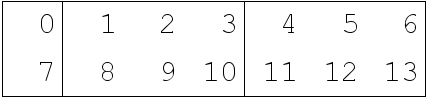
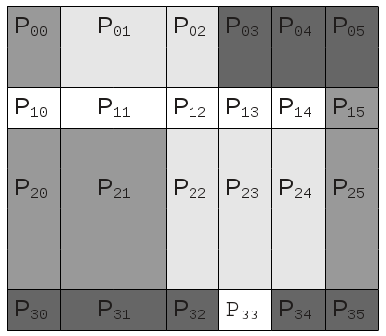

.. _framework:

The CFA framework
=================

A conceptual framework for the in-memory storage of aggregated arrays
---------------------------------------------------------------------

A **master data array** is one which is constructed from the one or
more **sub-arrays**.

The simplest master data array has just one sub-array which is equal
to itself, but in general, a master data array may have up to as many,
non-overlapping sub-arrays as is it has elements and each sub-array
contains a contiguous subset of the master data array values. See
:ref:`figure 1a <figure1a>` and :ref:`figure 2a <figure2a>` for
examples of master data arrays and their constituent sub-arrays.

A master data array constructed from sub-arrays arises naturally from
an aggregation process, such as by the `CF aggregation rules
<https://cf-pcmdi.llnl.gov/trac/ticket/78>`_.

Sub-arrays may be be combined to create hyperrectangular [#f1]_ master
data arrays, which poses storage and access difficulties since there
may be different numbers of sub-arrays across different sections of
the same master data array dimension. For example, the master data
array in :ref:`figure 2a <figure2a>` has three sub-arrays spanning the
first two rows (values 0 to 6 and 7 to 13) but only two sub-arrays
spanning third row (values 14 to 20). Such an irregular construction
would, for example, complicate finding which sub-array contained a
particular element or, more importantly, complicate the recombination
of sub-arrays into an equivalent master data array (an operation
required by the CF aggregation process).

A solution is to decompose the master data array into a
hyperrectangular **partition matrix** such that its elements (called
**partitions**) span all or part of exactly one sub-array. A given
**partition's data array** is then a reference to a unique part of a
unique sub-array. See :ref:`figure 1b <figure1b>`, :ref:`figure 1c
<figure1c>` and :ref:`figure 2b <figure2b>` for examples.

The master data array may be therefore be considered as being
constructed from a hyperrectangular matrix of partitions. See
:ref:`example 1 <example1>` and :ref:`example 2 <example2>`. 

A guaranteed hyperrectangular decomposition renders easy any
operations requiring knowledge of the partition locations within the
master data array (such as element location or partition matrix
transposition) and allows the master data array to be aggregated with
other master data arrays.

.. _larger-than-memory-arrays:

Larger-than-memory arrays
-------------------------

Sub-arrays larger than the available memory may be stored effectively
in memory by simply ensuring that such a sub-array is kept in a file
and partitioning the master data array so that each partition is small
enough to be realized in memory, if required.

.. _subspaces:

Subspaces
---------

A subspace of a master data array may be created easily by discarding
partitions which do not overlap the subspace and for each remaining
partition, adjusting the definition of the part of the sub-array which
comprises the partition’s data array (see the :ref:`part <part>`
parameter).

Partition matrix properties
---------------------------

* The partition matrix's dimensions are always a subset of the master
  data array's dimensions. I.e. each dimension of partition matrix
  index space corresponds to a dimension of the master data array.

* The partition matrix may be a scalar, if it contains exactly one
  partition whose data array spans the entire master data array.

* The partition matrix may span fewer dimensions than the master data
  array (see :ref:`figure 1b <figure1b>`, in which the partition
  matrix is 1-dimensional but the master data array is
  2-dimensional), but never more.

* The order of the partition matrix's dimensions may be different to
  the relative ordering of the equivalent dimensions of the master
  data array.

* The creation of a subspace of the master data array may result in
  one or more partitions which reference a non-contiguous part of a
  sub-array (see the :ref:`part <part>` parameter).

Examples
--------

.. _example1:

Example 1
~~~~~~~~~

The 2-dimensional 2 x 7 master data array in **figure 1a** is composed
from 3 sub-arrays. The most efficient way of partitioning the master
data array into a hyperrectangular partition matrix such that each
partition contains all or part of exactly one sub-array is shown in
**figure 1b**. Note that, in this case:

* The partitions' data arrays are not all of the same size or shape

* Each partition's data array spans an entire sub-array
      
* The partition matrix has fewer dimensions than the master data
  array.
     
.. _figure1a:

   
   **Figure 1a**. The 3 sub-arrays of the master data array.
     
.. _figure1b:

.. figure:: partitions1b.png

   **Figure 1b**. A 1-dimensional, 3 element partition matrix of the
   master data array. Each block of colour represents one of the 3
   sub-arrays and each partition of the partition matrix is
   labelled P\ :sub:`x`. For example, the partition data array of P\
   :sub:`0` contains values 0 and 7.

Another, equally valid partitioning of the master data array is shown
in **figure 1c**. Note that, in this case:

* No partitions' data arrays span an entire sub-array.

* The partition matrix has the same number of dimensions as the master
  data array.
    
.. _figure1c:

.. figure:: partitions1c.png

   **Figure 1c**. A 2-dimensional, 2 x 4 element partition matrix of
   the master data array. Each block of colour represents one of the 3
   sub-arrays and each partition of the partition matrix is is
   labelled P\ :sub:`yx`. For example, the partition data array of P\
   :sub:`11` contains values 8 and 9 and the partition data array of
   P\ :sub:`12` contains value 10.

.. _example2:

Example 2
~~~~~~~~~

The 2-dimensional 8 x 7 master data array in **figure 2a** is composed
from 10 sub-arrays. The most efficient way of partitioning the master
data array into a hyperrectangular partition matrix such that each
partition contains all or part of exactly one sub-array is shown in
**figure 2b**. Note that, in this case:

* The partitions' data arrays are not all of the same size or shape

* Some partitions' data arrays span an entire sub-array (P\ :sub:`00`
  and P\ :sub:`33`\), but the rest do not.
      
.. _figure2a:

.. figure:: partitions1.png
   
   **Figure 2a**. The 10 sub-arrays of the master data array.
     
.. _figure2b:

   **Figure 2b**. A 2-dimensional, 4 x 6 element partition matrix of
   the master data array. Each block of colour represents one of the
   10 sub-arrays and each partition of the partition matrix is
   labelled P\ :sub:`yx`. For example, the partition data array of P\
   :sub:`30` contains value 49; the partition data array of P\
   :sub:`31` contains values 50 and 51; and the partition data array
   of P\ :sub:`32` contains value 52.

Accounting for arbitrary partition data array properties
--------------------------------------------------------

There are properties of a partition's data array which are arbitrary
in the sense that, whilst these properties may differ to their
equivalents in the master data array, the partition's data array may
always be altered to conform with the master data array with no loss
of information.

A partition's data array inherits these properties, unchanged, from
the sub-array which contains it.

The properties for which a partition's data array may differ from its
master data array are:

* The order of dimensions.

* The number of size 1 dimensions.

* The sense in which dimensions run.

* The units of the data values.

* The missing data value.

When a partition's data array is required by the master data array, it
needs to be **conformed** by doing any or none of:

* Reordering its dimensions to the same order as the master data
  array.

* Removing size 1 dimensions which don't exist in the master data
  array.

* Adding size 1 dimensions which exist in the master data array but
  not in the partition's data array.

* Reversing dimensions which run in the opposite direction to the
  master data array.

* Converting the data values to have the same units as the master
  array.

* *Either* the missing data value is converted to that of the master
  array (accounting for conflicts with non-missing data values) *or*,
  if arrays are stored with ancillary missing data masks (as can be
  the case with `python numpy arrays
  <http://docs.scipy.org/doc/numpy/reference/maskedarray.html>`_, for
  example), the partition's data array's missing data value may be
  ignored.

.. _CFA-framework-parameters:

Parameters required for specifying a master data array
------------------------------------------------------

It follows that a master data array and its partitions may be
completely specified by a small number of parameters.

.. note:: When a partition has a parameter value equal to the master
          array then there is some redundancy which will be exploited
          when storing the array by its parameters with the
          :ref:`CFA-netCDF conventions <CFA-netCDF-conventions>`.

.. _Master-data-array-parameters:

Master data array parameters
~~~~~~~~~~~~~~~~~~~~~~~~~~~~

The master data array comprises:

   .. _frame-dtype:

   **dtype**
      The data type of the master data array.
   
   .. _frame-units:

   **units**
      The units of the master data array.
   
   **calendar** (*if required by* :ref:`units <frame-units>`)
      The calendar of the master data array.

   .. _frame-dimensions:

   **dimensions**
      An ordered list of the master data array's dimensions.
   
   **shape**
      An ordered list of the master data array's dimension sizes. The
      sizes correspond to the :ref:`dimensions <frame-dimensions>`
      list.
   
   **Partitions** 
      A matrix of the master data array's partitions. Each partition
      is described by its :ref:`partition parameters
      <frame-Partitions>`.
   
   .. _frame-partition-matrix:

Partition matrix parameters
~~~~~~~~~~~~~~~~~~~~~~~~~~~

   .. _frame-pmdimensions:

   **pmdimensions**
      An ordered list of the dimensions along which the master data
      array is partitioned. Each of these dimensions is one those
      specified by the :ref:`dimensions <frame-dimensions>` parameter.
   
   .. _frame-pmshape:

   **pmshape**
      An ordered list containing the number of partitions along each
      partitioned dimension of the master data array. The sizes
      correspond to the :ref:`pmdimensions <frame-pmdimensions>` list.
   
   .. _frame-Partitions:

Partition parameters
~~~~~~~~~~~~~~~~~~~~

Each partition of the partition matrix comprises:

   .. _frame-pdimensions:

   **pdimensions**
      An ordered list of the partition's data array dimensions.
   
   .. _frame-punits:

   **punits**
      The units of the partition's data array.
   
   **pcalendar** (*if required by* :ref:`punits <frame-punits>`)
      The calendar of the partition's data array.

   .. _frame_directions:

   **flip**
      A collection of the partition’s data array dimensions which run
      in the run in the opposite direction to those of the master data
      array.

   .. _frame_location:

   **location**
      An ordered list of ranges of indices, one for each dimension of
      the *master data array*, which describe the contiguous section
      of the master data array spanned by this partition. The ranges
      correspond to the :ref:`dimensions <frame-dimensions>` list.

   .. _frame_part:

   **part**
      An ordered list of indices for each dimension of the partition's
      data array which describe the part of the sub-array which is
      spanned by this partition. The indices correspond to the
      :ref:`pdimensions <frame-pdimensions>` list.
   
   .. _frame-subarray:

   **subarray**
      A reference to the sub-array which contains the partition's data
      array.

----

.. rubric:: Footnotes

.. [#f1] The generalization of a rectangle for higher dimensions.
